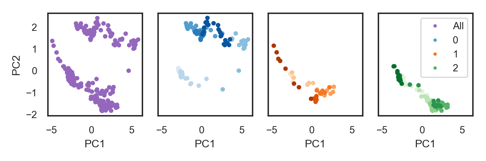

# narupa-cypa
NarupaXR Trajectories of loop motions in Cyclophilin A and accompanying analysis. 

The jupyter notebook narupa_cypa_analysis.ipynb performs a dimensionality reduction and feature extraction analysis of three trajectories produced 
with interactive molecular dynamics in VR (iMD-VR).



The notebook cypa_narupa_frame_selection.ipynb uses the results of that analysis to select frames. 

## Getting started. 

The following packages are required:
* MDTraj
* scikit-learn
* numpy
* seaborn
* matplotlib
* jupyter

Clone the repository, navigate to the root folder, and run

```
jupyter notebook
```
